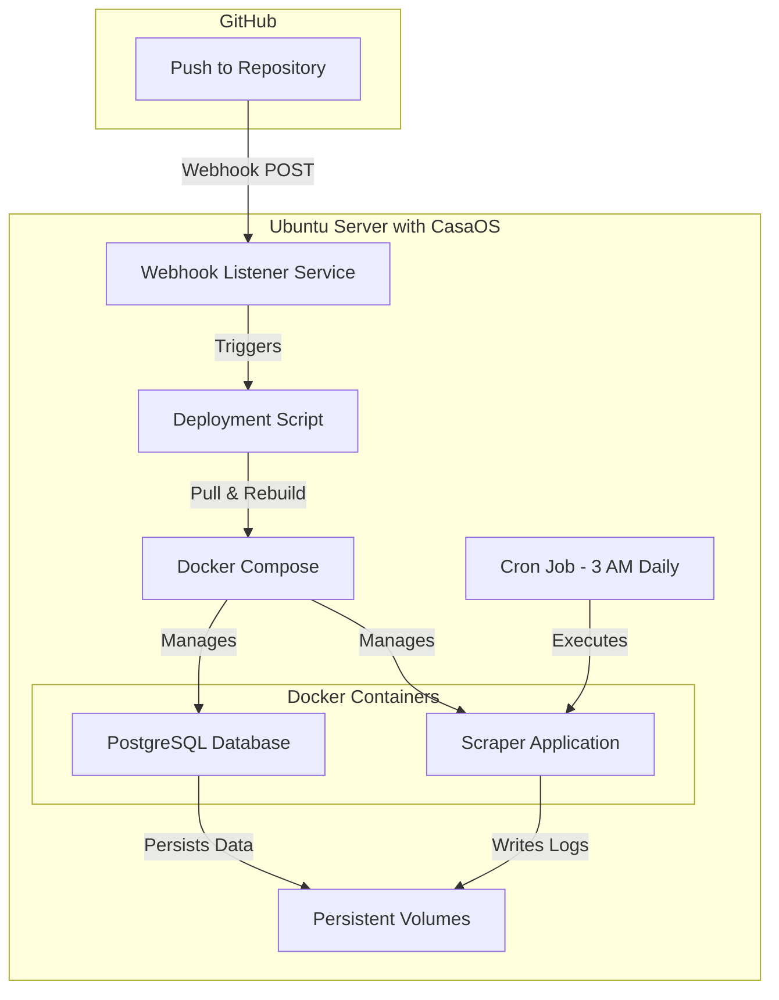

# Zwift Power Scraper - CasaOS Deployment Plan

## 🎯 Deployment Overview

This plan covers deploying the Zwift Power scraper on Ubuntu Server with CasaOS using Docker, with automatic updates via GitHub webhooks and daily execution at 3:00 AM via cron.

## 🏗️ Architecture Design



## 📋 Components to Create/Update

### 1. Docker Configuration
- **Dockerfile** - Update to match new modular structure (core/, database/, scripts/)
- **docker-compose.yml** - Configure for CasaOS with proper volume mounts and cron support
- **.dockerignore** - Optimize build context

### 2. Webhook Auto-Deployment System
- **webhook-listener/** - Lightweight webhook receiver service
  - `docker-compose.webhook.yml` - Separate compose file for webhook service
  - `webhook-config.json` - Webhook configuration
  - `deploy.sh` - Deployment script triggered by webhook
  
### 3. Cron Configuration
- **cron/zwift-scraper.cron** - Crontab entry for 3 AM execution
- **scripts/run-scraper.sh** - Wrapper script for cron execution

### 4. Server Setup
- **server-setup.sh** - Automated server initialization script
- **docs/DEPLOYMENT.md** - Complete deployment guide

## 🔧 Implementation Details

### Dockerfile Updates
**Changes needed:**
- Update COPY commands to include new directory structure (core/, database/, scripts/)
- Fix healthcheck to import from correct modules
- Ensure logs directory is created and writable

### Docker Compose Updates
**Changes needed:**
- Add volume mount for logs directory
- Configure restart policy for cron compatibility
- Add labels for CasaOS integration
- Remove one-time execution, prepare for cron triggering
- Ensure database persistence across updates

### Webhook System
**Components:**
1. **Webhook Listener** - Lightweight Go/Python service listening on port 9000
2. **Deploy Script** - Bash script that:
   - Validates webhook signature (security)
   - Pulls latest code from GitHub
   - Rebuilds Docker images
   - Restarts containers (preserving database)
   - Logs deployment activity

### Cron Setup
**Configuration:**
```bash
0 3 * * * /opt/zwift-scraper/scripts/run-scraper.sh >> /opt/zwift-scraper/logs/cron.log 2>&1
```

**Script responsibilities:**
- Check if containers are running
- Execute scraper via docker exec
- Handle errors and logging
- Send notifications on failure (optional)

### GitHub Webhook Configuration
**Settings needed:**
- Payload URL: `http://your-server-ip:9000/webhook`
- Content type: `application/json`
- Secret: Generated secure token
- Events: Push events on main/master branch

## 🔒 Security Considerations

1. **Webhook Security**
   - Use HMAC signature verification
   - Restrict webhook listener to specific IP ranges
   - Use firewall rules to limit port 9000 access

2. **Environment Variables**
   - Keep `.env` file secure with proper permissions (600)
   - Never commit `.env` to repository
   - Use `.env.example` as template

3. **Docker Security**
   - Run containers as non-root user
   - Use read-only mounts where possible
   - Keep base images updated

4. **Database Security**
   - Use strong passwords
   - Restrict PostgreSQL port exposure
   - Regular backups

## 📦 File Structure After Deployment

```
/opt/zwift-scraper/
├── .env                          # Environment variables (not in git)
├── .git/                         # Git repository
├── docker-compose.yml            # Main compose file
├── Dockerfile                    # Application container
├── requirements.txt              # Python dependencies
├── main.py                       # Entry point
├── zids.txt                      # Rider IDs to scrape
├── core/                         # Core modules
│   ├── client.py
│   ├── logger.py
│   └── pipeline.py
├── database/                     # Database modules
│   ├── engine.py
│   └── models.py
├── scripts/                      # Utility scripts
│   ├── cookie_refresher.py
│   └── run-scraper.sh           # Cron wrapper
├── webhook/                      # Auto-deployment system
│   ├── docker-compose.webhook.yml
│   ├── webhook-config.json
│   └── deploy.sh
├── logs/                         # Application logs (persistent)
│   ├── scraper.log
│   ├── cron.log
│   └── deployment.log
└── docs/                         # Documentation
    ├── DEPLOYMENT.md
    └── DOCKER_README.md
```

## 🚀 Deployment Workflow

### Initial Setup (One-time)
1. Clone repository to `/opt/zwift-scraper`
2. Copy `.env.example` to `.env` and configure
3. Run `server-setup.sh` to install dependencies
4. Start webhook listener service
5. Configure GitHub webhook
6. Set up cron job
7. Start Docker containers

### Update Workflow (Automatic)
1. Developer pushes code to GitHub
2. GitHub sends webhook to server
3. Webhook listener validates and triggers deploy script
4. Deploy script:
   - Pulls latest code
   - Rebuilds Docker images
   - Restarts containers (database persists)
   - Logs deployment
5. Cron continues to run scraper at 3 AM daily

### Manual Operations
- **View logs**: `docker-compose logs -f scraper`
- **Manual run**: `docker-compose exec scraper python main.py`
- **Database backup**: `docker-compose exec postgres pg_dump -U zwift_user zwift_racing > backup.sql`
- **Restart services**: `docker-compose restart`

## 📊 Monitoring & Maintenance

### Log Locations
- **Application logs**: `/opt/zwift-scraper/logs/scraper.log`
- **Cron logs**: `/opt/zwift-scraper/logs/cron.log`
- **Deployment logs**: `/opt/zwift-scraper/logs/deployment.log`
- **Docker logs**: `docker-compose logs`

### Health Checks
- **Container status**: `docker-compose ps`
- **Database connection**: `docker-compose exec postgres pg_isready`
- **Webhook service**: `curl http://localhost:9000/health`

### Backup Strategy
- **Database**: Daily automated backups via cron
- **Configuration**: `.env` file backed up separately
- **Code**: Managed via Git

## ⚠️ Important Notes

1. **Database Persistence**: PostgreSQL data is stored in Docker volume `postgres_data` and persists across container restarts and code updates

2. **Cookie Refresh**: The scraper automatically refreshes ZwiftPower cookies using Playwright when they expire

3. **CasaOS Integration**: Docker Compose labels allow CasaOS to manage and monitor the containers

4. **Port Conflicts**: Ensure ports 5432 (PostgreSQL) and 9000 (webhook) are available

5. **Timezone**: Cron runs in server timezone (America/Montevideo UTC-3), so 3 AM local time

## 🎯 Success Criteria

- ✅ Docker containers start successfully on server boot
- ✅ Scraper runs automatically at 3:00 AM daily
- ✅ GitHub pushes trigger automatic deployment
- ✅ Database data persists across updates
- ✅ Logs are accessible and rotated
- ✅ CasaOS can monitor container status
- ✅ Manual execution works via docker exec

## 📝 Next Steps

1. Review this plan and confirm approach
2. Create/update all Docker configuration files
3. Create webhook listener service
4. Create deployment and setup scripts
5. Create comprehensive deployment documentation
6. Test locally before server deployment
